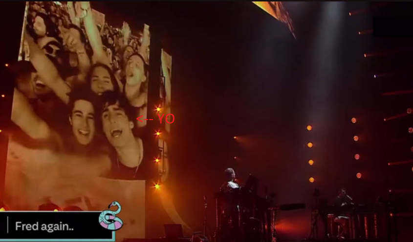

# Hola, soy Joaquin Zubiria.
---
Legajo: 2096584
### Sobre Mí 
En realidad mi nombre es más largo: Joaquin Tomas Zubiria Mansilla, pero además de eso me gustaría empezar con lo más personal, me encanta ir a conciertos, escuchar y hacer música. Son mis pasatiempos preferidos desde chico. Toco guitarra, algo de piano y manejo programas de producción. Mi artista favorito lejos es **Fred again..**; me cambio la manera de entender y ver la música.
 

#### Foto:

<i>Lollapalooza 2023, en la pantalla del escenario.</i>
 
####Estudios
- Egresado del Colegio FASTA Catherina
- Cursando 2do año de ING. en Sistemas
- Cursando Certified Tech Developer, una carrera digital hecha por Digital House en colaboración con Globant y Mercado Libre.
- Autodidacta -> Producción musical, programación web.